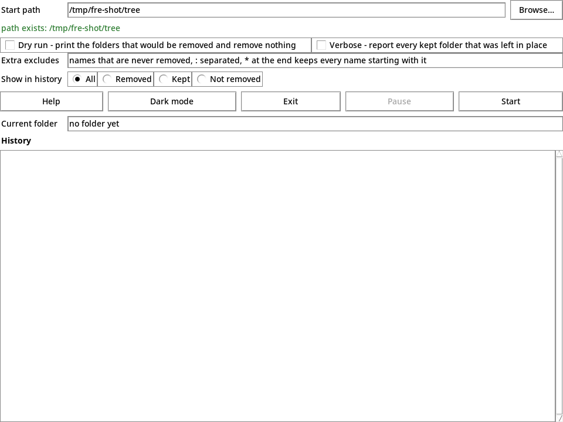
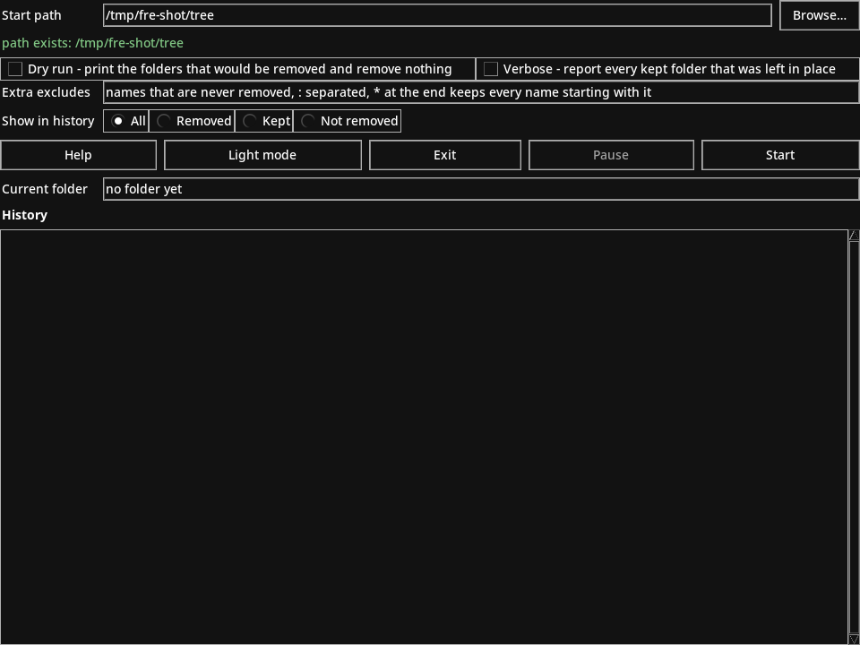

# FOLDER_REMOVE_EMPTY

> **Status — the port is complete.** The engine, the command line, the terminal
> mode, the generated man and tldr pages, the tkinter window and the persisted
> settings file are implemented and green (142 tests plus 107 subtests). The
> plan is in `todo/goal.md`, the behaviour contract in `project_specs.md`, the
> reference behaviour of the original Go program in
> `tests/folder_remove_empty/reference/`.

FOLDER_REMOVE_EMPTY removes every empty folder below a start folder, deepest
first. The start folder itself is never removed, only the folders below it.

One run removes a whole chain of nested empty folders: a folder counts as empty
as soon as its last empty subfolder is gone, so the deepest folder goes first
and its parent follows in the same run.

The tool has two front ends over one shared engine: a desktop window (the
default) and a terminal mode selected with `--no-gui`. Command-line options
given at startup pre-fill the window; in terminal mode they run unchanged.

This is the Python rewrite of the same tool; the rules of the previous Go
implementation are unchanged.

## Requirements

- **Python 3.13 or newer** and nothing else at runtime — the program is stdlib
  only.
- **tkinter for the window** (the terminal mode needs no window toolkit).
  - Fedora: `sudo dnf install python3-tk`
  - Debian/Ubuntu: `sudo apt install python3-tk`

## Install

```bash
pipx install .          # an isolated install with the folder_remove_empty script
# or
make install            # a launcher in ~/sbin, the icons and the .desktop file
```

`make install` writes a launcher into `~/sbin/folder_remove_empty` that runs the
program from this checkout (`cd <repo> && exec python3 -m folder_remove_empty "$@"`),
copies the eight icon sizes to
`~/.local/share/icons/hicolor/<size>x<size>/apps/folder_remove_empty.png`, and
installs `assets/folder_remove_empty.desktop` into
`~/.local/share/applications/` (validated with `desktop-file-validate` when it is
present). The entry then appears in the application menu as
`FOLDER_REMOVE_EMPTY` and resolves `Exec=folder_remove_empty` through `~/sbin`.
`make uninstall` removes the launcher, the icons and the entry again;
`DEST_DIR` and `DATA_DIR` override the two target folders.

### Standalone binary

The standalone binary comes from the repository's build script (Nuitka):

```bash
./_build --package      # one compiler job, writes build/folder_remove_empty
```

It produces `build/folder_remove_empty` (a 14 MB onefile binary with Tcl/Tk
bundled, no Python installation needed), `build/SHA256SUMS` and
`build/release_manifest.json`. Verify with `cd build && sha256sum -c
SHA256SUMS`. `./_build --release` additionally tags the commit and publishes a
GitHub release with those three files. Note that `_build` installs the binary
into `~/sbin/folder_remove_empty`; run `make install` afterwards when the
launcher should live there instead.

## The window

The window is the default front end. Light and dark theme, as the program paints
them (`assets/window-light.png`, `assets/window-dark.png`; the theme button in
the row below names the theme it switches to):





Top to bottom it holds:

| Row | What it holds |
|---|---|
| Start path | the `Start path` field, pre-filled with the startup path (or the current folder when none was given), and a `Browse…` button behind it |
| Status | a line below the field, refreshed live as you type: `path exists: <absolute folder>` when usable, `ERROR: <reason>` when not |
| Options | `Dry run - print the folders that would be removed and remove nothing` and `Verbose - report every kept folder that was left in place`, side by side |
| Extra excludes | the `Extra excludes` field: names that are never removed, `:` separated, `*` at the end keeps every name starting with it |
| Show in history | four radio buttons: `All` (the default), `Removed`, `Kept`, `Not removed` |
| Buttons | `Help`, the theme toggle, `Exit`, `Pause`, `Start`, in this order |
| Current folder | a read-only line following the folder rated or removed right now |
| History | the bold `History` heading and the scrollable list, one line per outcome, auto-scrolled to the bottom |

The buttons:

- **Help** opens the help dialog: the heading `Help`, the usage text (the same
  text as `--help`) one line per row in a bordered scrollable list, and an `OK`
  button below it.
- **Theme toggle** reads `Dark mode` in the light theme and `Light mode` in the
  dark one, and repaints background, foreground, borders and history colors.
  The window always starts in the light theme.
- **Exit** stops a run in flight and closes the window.
- **Pause** is disabled while idle; during a run it holds the job in front of
  the next folder and turns into `Resume`. Pressing again lets the run continue.
- **Start** reads `Start` when idle and `Restart` during a run. A refused path
  re-checks and appends a red `ERROR:` history line without starting anything; a
  valid path stops a run in flight first and starts over with the current field
  settings.

The history colors follow the outcome: removed green, dry-run `would remove`
amber, kept grey, refused orange, errors red, and the run notes (the `start
folder:` line and the closing counters) in the default foreground.

### Folder selection

`Browse…` opens the standard folder dialog of the toolkit
(`tkinter.filedialog.askdirectory`), starting in the folder in the path field or
in the current working folder when that field cannot be used. Confirming puts
the chosen folder into the field and re-runs the check; cancelling leaves the
field as it was. This is a deliberate deviation from the previous
implementation, which asked an external desktop helper for the dialog — the port
uses the picker a tkinter application offers, so no extra program is needed.

When no dialog is available at all, a built-in picker replaces the window
content: the heading `Choose folder`, the folder currently listed, an error line
only when that folder cannot be read, an `Up` button, a bordered scrollable list
with one button per subfolder (alphabetical, folders only), and a bottom row
with `Select` and `Cancel`.

## Terminal mode (`--no-gui`)

The terminal mode splits its output over the two streams:

- **stdout**: `removed: <folder>` lines and the closing summary
  (`<n> empty folder(s) removed`, or `no empty folder found`).
- **stderr**: `path exists:` (only when a path was given), `start folder:`,
  `excluded, kept:` lines, `not removed: <folder> (<reason>)` lines, the
  `<n> folder(s) kept` counter when removals were refused, and `ERROR:` lines.

Colors (green removed, yellow not removed, red error) appear only on a terminal
and are switched off by a non-empty `NO_COLOR`.

A **dry run** prints the plain folder paths, one per line, on stdout and removes
nothing; it prints no closing summary. Errors print as `ERROR: <reason>` on
stderr.

## Kept folders

These names are never removed on their own, matched by folder base name:

- `.Trash-1000`, `.cache`, `System Volume Information`, `$RECYCLE.BIN` (with or
  without the leading dot);
- every name starting with `ZZZZ`;
- every name starting with four ASCII digits, e.g. `2026-09-23_backup`;
- every name containing `!!! MISSING !!!` in any letter case.

The empty subfolders of a kept folder are still removed; the kept folder itself
stays, even when it is empty afterwards — unless its parent is removed as well.

**Extra excludes** add names on top of that list, from the `Extra excludes`
field or the `FOLDER_REMOVE_EMPTY_EXCLUDE` environment variable. The value is
`:` separated, empty pieces are ignored, and a name ending with `*` keeps every
name starting with that prefix (`keep-*` keeps `keep-me`); anything else must
match exactly.

## Environment variables

| Variable | Meaning |
|---|---|
| `FOLDER_REMOVE_EMPTY_EXCLUDE` | Extra kept names, `:` separated; a trailing `*` makes a prefix rule. Pre-fills the `Extra excludes` field. |
| `NO_COLOR` | A non-empty value switches the terminal colors off. |

## Settings file

The window remembers its geometry, the two checkboxes, the extra excludes, the
history filter and the theme in

```text
~/.config/folder_remove_empty/folder_remove_empty.conf
```

an INI file with a `[window]` section (`width`, `height`, `x`, `y`) and an
`[options]` section (`dry_run`, `verbose`, `excludes`, `history_filter`,
`dark`). It is written by the window when it closes and read by both front ends
as the lowest-precedence pre-fill: a command-line option wins over the file, and
the file wins over the built-in default. A missing, unreadable or malformed file
simply yields the defaults, and a failed write never blocks the close.

## Exit codes

| Code | Meaning |
|---|---|
| `0` | the job ran to its end (folders removed or listed), or an informational output (`--help`, `--version`, `--print-man`, `--print-tldr`) was produced |
| `1` | the given path does not exist, is not a folder, more than one path was given, or an option is unknown |

## Examples

```text
folder_remove_empty /data/archive                        # in the window
folder_remove_empty --no-gui /data/archive               # on the terminal
folder_remove_empty --dry-run --verbose /data/archive    # look first
FOLDER_REMOVE_EMPTY_EXCLUDE='keep-*:downloads*' \
    folder_remove_empty --no-gui /data/archive           # extra kept names
```

`--help` prints the usage text, `--version` prints
`folder_remove_empty version <stamp>`, `--print-man` prints the man page and
`--print-tldr` the tldr page.

## Development

The code is one GUI-free engine plus thin front ends: `remove_empty_folder_core.py`
imports no tkinter and does no I/O, so `scan_tree()`, `Scan.mark_deletes()` and
`execute()` are reusable by other programs and testable headless. The window and
the terminal reporter are two implementations of the one `Observer` interface,
which is what the tests drive.

```bash
./_tests                # pytest, ruff and mypy
./_tests --quick        # the test suite alone
python3 -m pytest       # the suite without the Makefile
make test               # the same as ./_tests
```

The tests are `unittest.TestCase` classes in `tests/folder_remove_empty/`, run
by pytest.

## Documentation

- [man page](man/folder_remove_empty.1) — `folder_remove_empty --print-man`
- [tldr page](tldr/folder_remove_empty.page.md) — `folder_remove_empty --print-tldr`
- [ChangeLog.md](ChangeLog.md) — the per-version log, newest first
- [NEWS](NEWS) — the user-facing highlights of each release

The man page and the tldr page are generated by the program itself, so they
cannot drift from the behaviour above; the generators land in phase 4 of
`todo/goal.md`, before either file exists.

## Icon

The icon is a purple rectangle with the white letters "fr", drawn in every size
a desktop asks for (16, 24, 32, 48, 64, 128, 256 and 512 pixels) below
`assets/icons/`. The window sets the largest one for the window manager, and
`make install` copies the whole set into the icon folder of the desktop. `make
icons` draws the set again; it needs ImageMagick 7 (`magick`) and a DejaVu font:

```bash
sudo dnf install ImageMagick dejavu-sans-fonts
```

## License

MIT, see [LICENSE](LICENSE).
